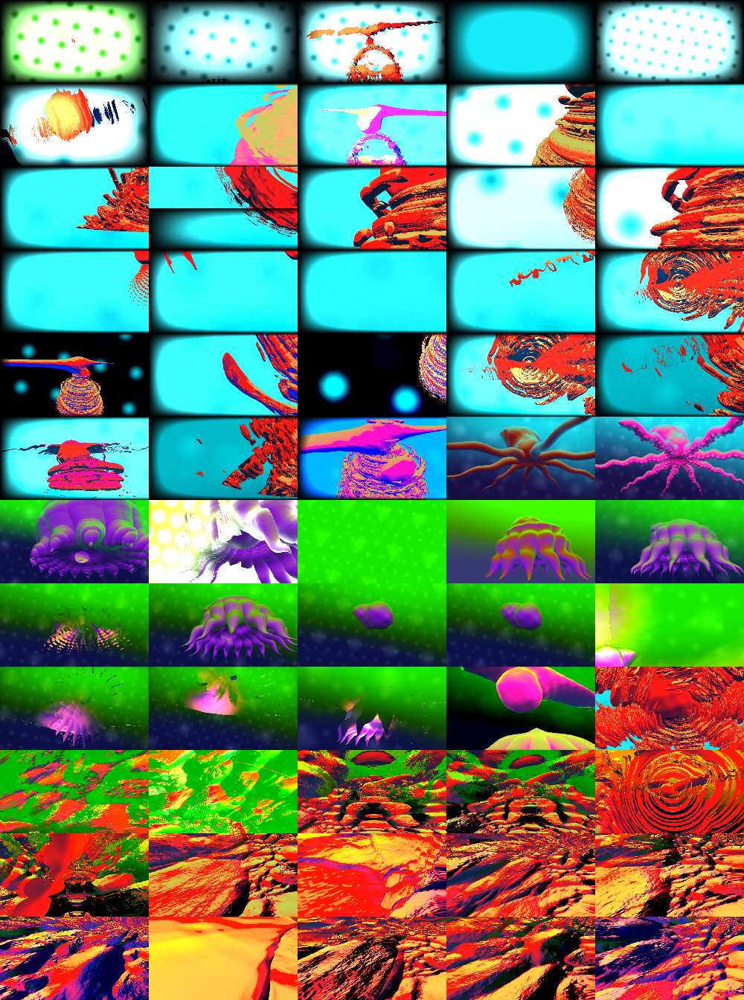

# ☢ MUTAGEN ☢

There's an incredible breadth of art people have created on websites like [Shadertoy](https://www.shadertoy.com/browse).

You never had to be a programmer to mess around with any of these, just fiddling with random numbers, but doing that manually is tedious. *We can automate this.*

Mutagen simplifies this process and gives you direct creative control over programs you don't have to understand.

It captures thumbnails of the output, and you can:

- Double click on any thumbnail to mutate it, creating a new thumbnail. Target ones you like in order to create variations on it, and target ones that retain more of the structure of the output, such as the original, for more likely coherent results.
- Single click to view any specimen
- ~~Drag a thumbnail onto another to breed the two together, splicing their genes. This creates a new thumbnail.~~
- Drag thumbnails into the breeding box and click Breed to make mixes of the mutations, manifesting as more thumbnails

Mutagen lets you **create novel works of art by remixing procedural art thru a visual interface.**

<!-- https://en.wikipedia.org/wiki/Selective_breeding -->

## Development Setup

- Install Git if you don't already have it.
- [Clone the repo.](https://help.github.com/articles/cloning-a-repository/)
- Open up a terminal in the project directory.
- For **Firefox**:
  - Install [Node.js](https://nodejs.org/) if you don't already have it.
  - Run `npx web-ext run` in the project directory
  - It will open a window with the extension temporarily installed.
  - When you make changes:
    - It will automatically reload the extension.
    - You'll need to reload pages you're testing on to get the updated content script.
- For **Chrome** or **Chromium**:
  - Type `chrome://extensions` in the address bar
  - Turn on Developer mode
  - Click "Load unpacked" and select the root of this repository as the folder
  - When you make changes:
    - Click the Reload button in the Extensions page
    - Then reload pages you're testing on to get the updated content script.

## Usage
- Open up Shadertoy - try ["Clover"](https://www.shadertoy.com/view/XsXGzn), that's a good one (especially if you've played [Five Leaf Clover](https://www.kongregate.com/games/moczan/ultimate-five-leaf-clover) first)
- Click on the extension icon in the browser toolbar / address bar

### Try Without Installing

I plan on distributing this as a browser extension, and maybe a bookmarklet (pared down version?), but for now:

- Copy the contents of [mutagen.js](mutagen.js)
- Open up Shadertoy - try ["Clover"](https://www.shadertoy.com/view/XsXGzn), that's a good one (especially if you've played [Five Leaf Clover](https://www.kongregate.com/games/moczan/ultimate-five-leaf-clover) first, haha)
- Open your browser's devtools with <kbd>F12</kbd> or <kbd>Ctrl+Shift+I</kbd> or <kbd>Cmd+Shift+I</kbd>
- Switch to the console tab if it's not already selected
- Paste and hit enter

### Criteria for a good candidate for mutation

- As much as possible of the code should be [dedicated directly to the visual structure of the output](https://www.shadertoy.com/view/XsXGzn), rather than technical details like [implementing a ray tracer](https://www.shadertoy.com/view/lsX3DH). (The ability to mutate only selected areas of code will help with this.)
- No dramatic scene transitions / camera changes / other dramatic shifts over time, as these can make it hard to understand what's from the mutations and what's part of the original, or compare specimens in general; this is not a dealbreaker tho. (It could help for comparison to reset time to 0 or some point for the screenshots.)
- Fast, because it's not so fun when your computer is lagging 😛

## Glossary

This codebase needs a bit of a glossary, especially since "edit" and "edit point" are two distinct concepts.

- **doc**: an array of parts representing a loosely parsed program ("document", but always abbreviated "doc" so as not to conflict with the browser global `document`)
- **part**: part of a doc - either a string (just some text in the doc), or an edit point object
- **edit point**: part of a doc to be mutated, represented by an object that holds the original text at that location
- **edit**: an object that specifies text to override the text of an edit point, referencing the edit point by an index into a doc

## License

MIT-licensed, see [LICENSE](LICENSE)

[DNA icon by Kenton Quatman](https://thenounproject.com/term/dna/12357/) from the Noun Project
